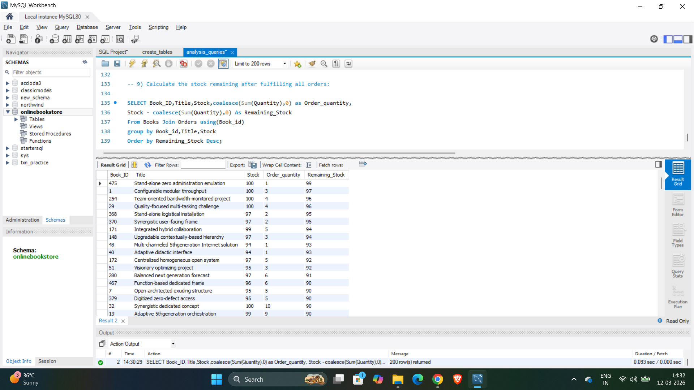

# 📚 SQL Online Bookstore Analysis


---

# 📌 Project Overview

This project analyzes sales and customer purchasing behavior for an **Online Bookstore** using SQL.
The objective is to extract meaningful insights from transactional data such as **sales performance, customer behavior, and inventory status**.

The analysis demonstrates practical SQL skills commonly used in real-world **data analytics and business intelligence** projects.

Key SQL concepts used in this project include:

* Joins
* Aggregations
* Group By
* Data Analysis Queries
* Business Insights Extraction

---

# 📊 Project Preview

This project explores bookstore sales data to answer important business questions such as:

• Which books are selling the most?
• How much revenue is generated from sales?
• Which customers spend the most money?
• Which cities have the highest purchasing customers?
• How much inventory remains after fulfilling orders?

The analysis is performed using **SQL queries on structured datasets**.

---

# 📈 Key Insights Generated

• Identify **best-selling books** based on order volume
• Calculate **total revenue generated from book sales**
• Analyze **customer purchasing behavior**
• Identify **cities with highest spending customers**
• Monitor **remaining inventory after fulfilling orders**
• Track **overall bookstore sales performance**

---

# 📂 Dataset Used

The project uses three datasets representing a simplified **online bookstore database**.

### 📘 books.csv

Contains book information such as:

* Book ID
* Title
* Author
* Price
* Stock quantity

### 👥 customers.csv

Contains customer information including:

* Customer ID
* Customer Name
* City
* Email

### 🛒 orders.csv

Contains purchase transactions:

* Order ID
* Customer ID
* Book ID
* Quantity purchased
* Order date

---

# 🗄 Database Structure

The project creates three relational tables:

• **Books**
• **Customers**
• **Orders**

### Relationships between tables

orders.book_id → books.book_id
orders.customer_id → customers.customer_id

These relationships allow us to combine tables using **SQL joins** to analyze sales and customer activity.

---

# 💻 Sample SQL Query – Remaining Stock Analysis

The following SQL query calculates **remaining inventory after fulfilling customer orders**.

```sql
SELECT 
    b.book_id,
    b.title,
    b.stock,
    COALESCE(SUM(o.quantity),0) AS order_quantity,
    b.stock - COALESCE(SUM(o.quantity),0) AS remaining_stock
FROM books b
LEFT JOIN orders o 
ON b.book_id = o.book_id
GROUP BY b.book_id
ORDER BY remaining_stock DESC;
```

---

# 📊 Query Result Example

The screenshot below shows the output of the SQL query executed in **MySQL Workbench**, displaying the remaining stock for each book after orders are processed.



---

# 📊 Example Business Queries

Some of the analytical questions answered in this project include:

• Total number of books sold
• Top selling books
• Total revenue generated
• Customers with highest spending
• Cities with highest customer spending
• Remaining stock after fulfilling orders

These queries help demonstrate how SQL can be used to extract **business insights from raw data**.

---

# 🛠 Tools & Skills Used

• SQL
• MySQL Workbench
• Data Analysis
• Joins & Aggregations
• GitHub

---

# 🚀 How to Run This Project

Follow the steps below to reproduce the analysis:

1. Import the CSV datasets into your SQL environment.
2. Run the **create_tables.sql** script to create the database tables.
3. Insert the dataset into the tables.
4. Execute **analysis_queries.sql** to perform the analysis.

---

# 📂 Project Structure

```
SQL-Online-Bookstore-Analysis
│
├── dataset
│   ├── books.csv
│   ├── customers.csv
│   └── orders.csv
│
├── sql
│   ├── create_tables.sql
│   └── analysis_queries.sql
│
├── images
│   └── query_result.png
│
└── README.md
```

---

# 👨‍💻 Author

**Naveen Babu Kommu**
Data Analyst

📧 [naveenbabukommu543@gmail.com](mailto:naveenbabukommu543@gmail.com)

---

⭐ If you found this project useful, consider giving it a **Star ⭐ on GitHub**.
